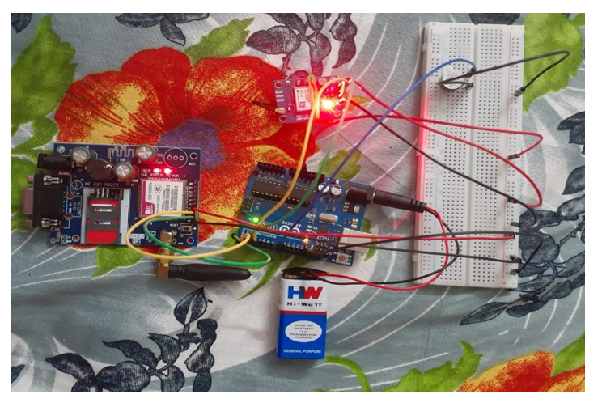
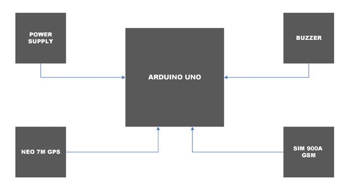
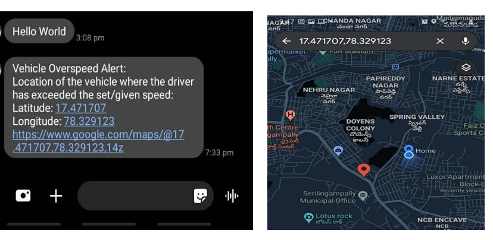

# Vehicle Mounted Alarm and Speed Indicator System

  An IoT-based standalone vehicle speed monitoring system that tracks real-time speed using GPS, alerts the driver with a buzzer on overspeeding, and automatically sends an SMS with GPS coordinates to authorities if the speed limit is repeatedly violated.

  > Project developed as part of **Microcontrollers and Interfacing** course at **Amrita Vishwa Vidyapeetham, Chennai**

  ## How It Works
  
  1. Arduino UNO continuously reads speed data from GPS Neo-7M module
  2. GPS calculates real-time vehicle speed based on latitude and longitude changes
  3. If speed exceeds 50 km/h, buzzer sounds as first warning to the driver
  4. If speed limit is violated a second time, Arduino sends SMS via SIM900A GSM module
  5. SMS contains vehicle location with latitude, longitude and a Google Maps link
  6. Authority can track exact location where overspeeding occurred

  ## 📸 Project Setup
  
  
  ## ⚙️ Hardware Components

  | Component | Role |
  |---|---|
  | Arduino UNO | Main microcontroller |
  | GPS Neo-7M | Real-time speed and location tracking |
  | SIM900A GSM Module | Sending SMS alerts |
  | Buzzer | Audio warning on first overspeed |
  | 9V Battery | Power supply |

  ## Block Diagram
  
  
  ## 🛠️ Software & Tools

  - Arduino IDE — Firmware development
  
  ##  How the Alert Logic Works
  
  1. Speed is read continuously from GPS module
  2. If speed >= 50 km/h, buzzer beeps as first warning
  3. A counter increments each time speed limit is exceeded
  4. When counter exceeds 1, SMS is triggered automatically
  5. SMS includes latitude, longitude and Google Maps link of violation location

  ## Results

  -  Buzzer alarm triggered successfully on first overspeed
  -  SMS with GPS coordinates delivered to authority number on repeated violation
  -  Google Maps link in SMS showed exact location of overspeeding
  -  System tested successfully on a real vehicle

   

  ## 🔮 Future Scope

  - Develop a dedicated mobile app for traffic authorities to track all violations
  - Scale the system to monitor multiple vehicles simultaneously
  - Integrate with national traffic violation database for automated penalty issuance

**Institution:** Amrita Vishwa Vidyapeetham, Chennai — B.Tech ECE (3rd Year)
  
